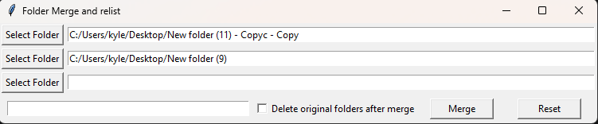

File Merge

A simple Python desktop application that merges files from multiple folders into a single folder and renames them sequentially.

Features
Select multiple folders using a Tkinter file dialog
Display selected folder paths in the UI
Sort files using natural sorting
Create a new output folder with a custom name
Copy files into the new folder without modifying the original files
Rename copied files sequentially:
1.jpg
2.jpg
3.png
...
Prevent creation of an output folder if the same folder name already exists
Optionally move the original folders to the Recycle Bin after a successful merge
Reset the selected folders and UI
How It Works

For example, if the selected folders contain:

```text
Folder1
├── image_1.jpg
├── image_2.jpg
└── image_10.jpg

Folder2
├── photo_1.jpg
└── photo_2.jpg
```

The program creates a new folder containing:

```text
Merged
├── 1.jpg
├── 2.jpg
├── 3.jpg
├── 4.jpg
└── 5.jpg
```

Files are processed using natural sort order.

Requirements
Python 3
Tkinter
natsort
Send2Trash

Install the required packages:

pip install natsort send2trash
Usage
Run the Python script.
Click Select Folder and choose a folder.
Additional folder selection rows will appear automatically.
Select all folders you want to merge.
Enter a name for the new output folder.
Optionally check Delete original folders after merge.
Click Merge.
The files will be copied to the new folder and renamed sequentially.
Safety

The application uses shutil.copy2() to copy files so the original files are not modified during the merge.

If Delete original folders after merge is enabled, the original folders are moved to the Windows Recycle Bin using send2trash() only after the merge completes successfully.

## Example Screenshot



Libraries Used
os — file and path operations
shutil — file copying
tkinter — graphical user interface
natsort — natural file sorting
send2trash — safely moving original folders to the Recycle Bin
